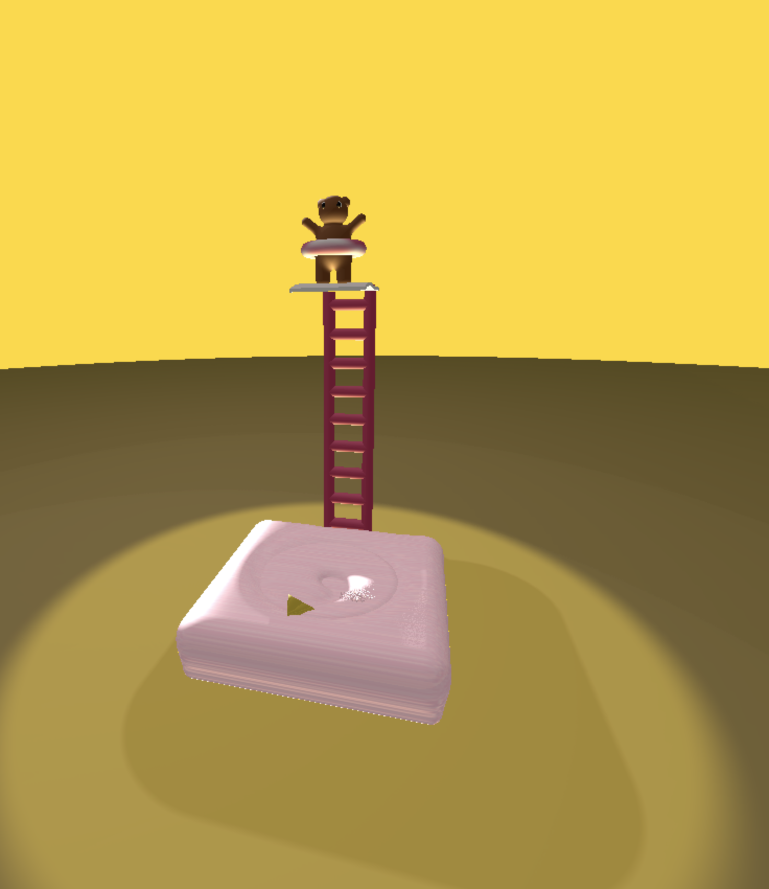
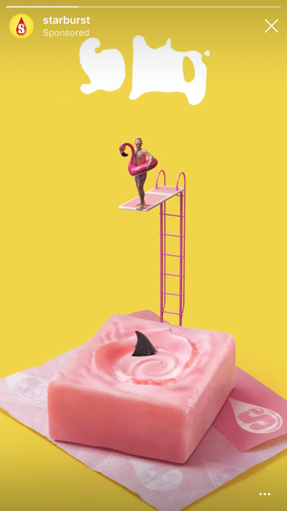

CIS 566 Homework 3: Environmental Setpiece
=====================================

Written by Julia Chun (hyojchun)

Project Results
----------------
### Inspiration

A published demo can be found here :

https://hjchun96.github.io/hw03-environment-setpiece/

Below is the final image generated by the code:

It was inspired by a starburst advertisement I saw on Instagram

Implementation Details
----------------------
### Scene Animation

* Animation: The plank is animated to move up and down and the candy is designed so that its center piece swirls with a shark fin moving along it.

* 3 Different Use of Noises: Perlin noise is used to modify the normals of the candy, add stripes to the candy for texturing, and chaning color of tube to give it stripes. FBM noise is used to randomy generate little spheres that emulate bubbles rising out of the center of swirl of the candy.

* Remapping color: `getObjectColor` shows how based on which sdf geometry was hit by the ray, the geometry's identifying number in the range of 0~1 decides which color it should be colored as.

* Toolbox Functions: square_wave was used for adding lighlights to the candy as well as well as deciding square factor when positioning the bubbles on the candy.

* Approximate Environmental Lighting: `phongContribForLight` contains two lights shining far above and another light source is present as can be seen in `render`.
Two ambient lightings of pink and yellow colors are also used.

* SDF based soft shadows implemented.

### Additional Techniques
* Approximated Fresnel Reflectivity (Specular Reflection?) for extra reflection on edges.

* Vignette on the ground to highlight the centerpiece.

* Ambient Occlusion implemented for extra credit.

References & Resources
----------------------
* Spiral Distance Field: https://swiftcoder.wordpress.com/2010/06/21/logarithmic-spiral-distance-field/ and
* Shark-fin Animation and Triangle SDF : https://www.shadertoy.com/view/4d3cR4, https://paroj.github.io/gltut/Positioning/Tutorial%2003.html
* Vignette: https://github.com/mattdesl/lwjgl-basics/wiki/ShaderLesson3
* Specular Reflection & Fresnel Approximation: https://en.wikibooks.org/wiki/GLSL_Programming/Unity/Specular_Highlights_at_Silhouettes
